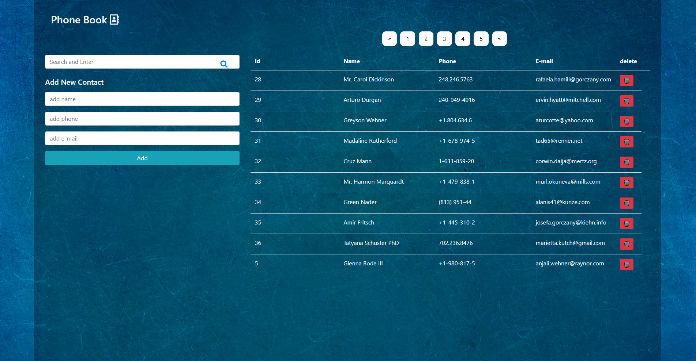

# phone-book
# 📖 Phone Book

## 📌 Overview

**Phone Book** is a simple and practical web application that allows users to manage their contacts. Users can add, edit, delete, and search for contacts. All contact information is **persistently stored in a MySQL database**, and **PHP** is used for server-side processing. The user interface is built with **HTML** and **Bootstrap** to ensure a responsive and clean design.

## 🎯 Features

- Add a new contact (first name, last name, phone number, etc.)
- Edit existing contact details
- Delete contacts from the list
- Search for contacts by name or phone number
- View all saved contacts
- Persistent data storage using MySQL

## 🛠 Technologies Used

- **HTML** – Markup for building the structure of the pages
- **Bootstrap** – Responsive and modern UI design
- **PHP** – Server-side scripting and database interaction
- **MySQL** – Storing contact data persistently

## 🧪 Screenshots

